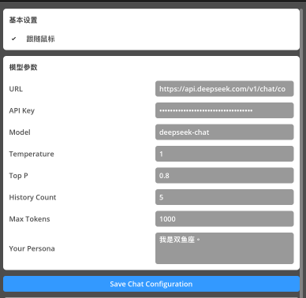
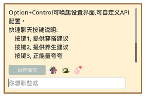
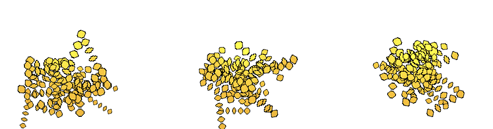

# Desktop Pet

## 一、项目概述

Desktop Pet 是一个基于 Godot 4.3 开发的 AI 桌面宠物应用。项目集成了大语言模型对话、语音合成等 AI 能力，提供了一个可互动的桌面伴侣。

### 核心特性

- AI 对话：集成 LLM API，支持上下文对话
- 语音互动：支持 TTS 语音合成
- 动画效果：角色动画、特效系统
- 窗口管理：支持多功能窗口
- 配置系统：支持多维度配置管理

### 使用说明

1. 下载最新发布版本
2. 运行 project.godot
3. 点击桌宠后，按下 Option+control键（MAC）配置 API 密钥，保存配置
4. 开始对话
5. 输入`# help`可获取指令帮助

项目开发文档可见 [System Architecture](SystemArchitecture.md) 文档。

## 二、运行展示

你可以扫描下面的二维码，观看视频展示。

如下图所示，在启动程序后，迎接用户的是**FaFa**——一个活泼互动的“幸运树”桌面伴侣。FaFa可以跟随鼠标指针的移动，并支持窗口透明，确保它不会干扰用户的工作流程。

点击 FaFa 会弹出一个聊天窗口，用户可输入请求进行聊天交互。

Option+Control 会弹出一个设置窗口。在设置面板中，用户可以配置API，选择语音样式，并输入个人信息以接收个性化响应。

FaFa的快速聊天功能提供个性化的日常着装建议、健康提示和激励信息。用户只需点击相应的图标就可以收到量身定制的建议。例如，如果用户将他们的个人信息设置为“我是双鱼座”，FaFa将为每个快速聊天选项生成定制的响应。

FaFa在聊天窗口配置了“语音播放”按键，用户可点击该按键，进行语音合成播放。

此外，用户还可输入特殊指令：

- `# help` 获取指令帮助
- `# money` 触发撒金币特效与音频
- `# rest` 触发休息模式，播放雨声白噪声

 

## 三、未来开发计划

- 接入文件管理MCP

## 四、致谢

本项目基于 [xccds](https://github.com/xccds) 的开源项目 [DesktopPet:](https://github.com/xccds/DesktopPet) 进行开发。感谢原作者的无私分享和杰出贡献。

联系方式：

- chenxc-cxc（1341837103@qq.com）& nia717（1404199069@qq.com）

## 五、项目二维码

## 六、版权声明

本项目基于 MIT 许可证开源：

- 原始版权所有 © 2024 xccds
- 修改版权所有 © 2025 chenxc-cxc & nia717

详细许可证条款请参见 [LICENSE](LICENSE) 文件。
