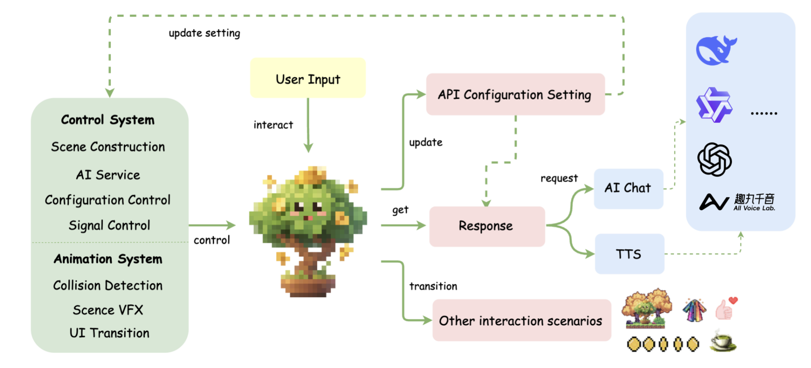
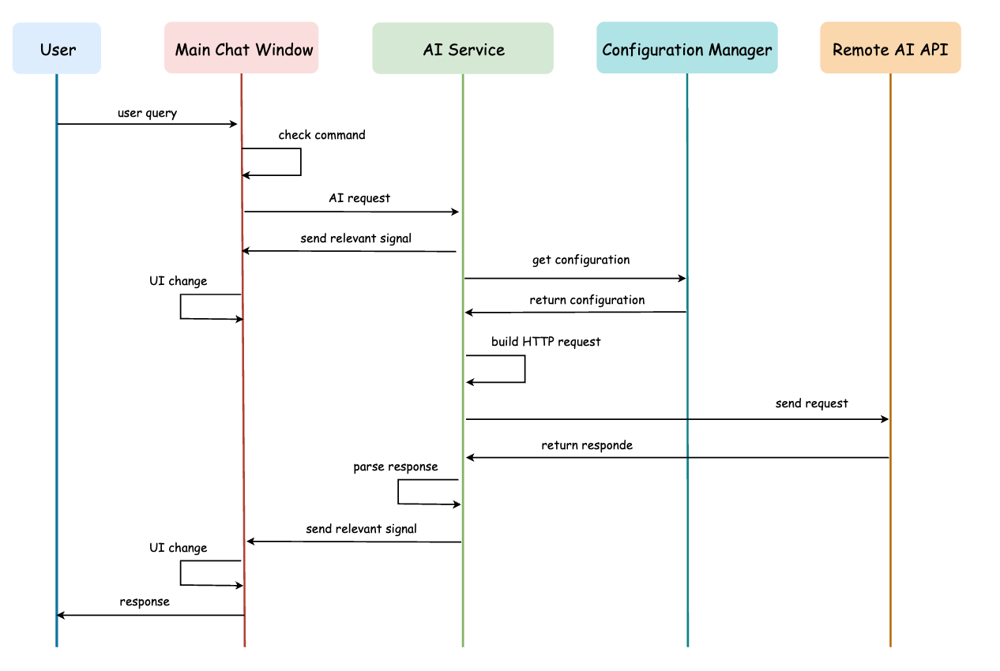
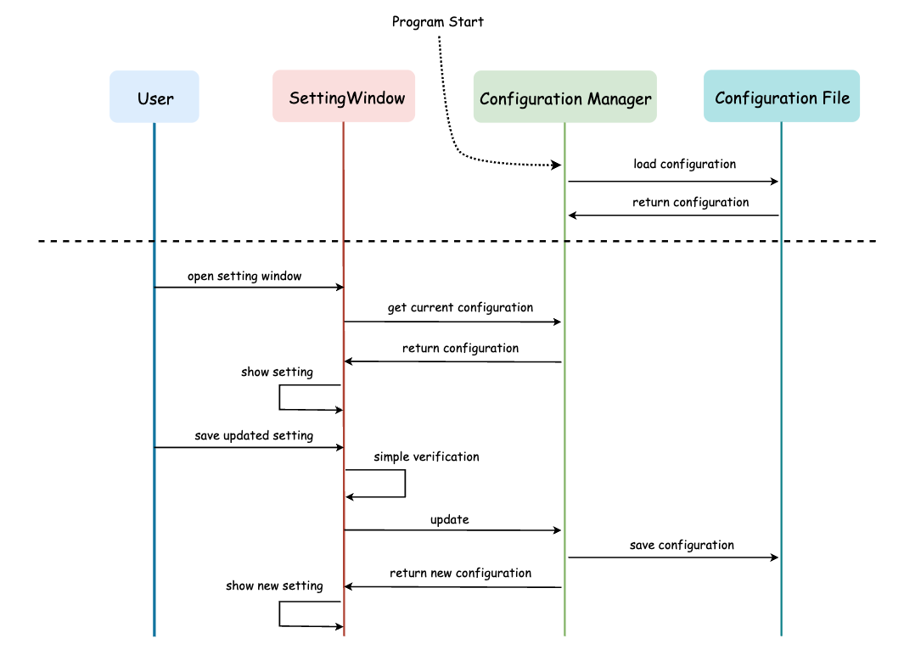

## 一、方法说明

本项目采用模块化设计，主要分为三大核心部分：场景系统、AI 服务集成层与 配置管理系统，构建了一个可交互、可扩展的智能桌面宠物应用，各模块之间通过异步信号系统通信互动，确保了各模块之间的高效合作和低耦合性。




## 二、AI 集成

后端AI服务模块为桌宠提供语言理解与语音交互能力，整体通过标准 HTTP 请求与外部 API 通信，默认接入 DeepSeek、AllVoiceLab 等服务：我们默认集成了 DeepSeek 的 API 进行文本生成，支持用户画像设定以实现用户定制化响应，同时使用信号机制实现异步响应，保证回复速度快、体验流畅。语音合成方面，我们默认接入了 AllVoiceLab 的 TTS 引擎。用户可以实时切换不同风格的语音，并获得语音回复。

除了默认接入的DeepSeek、AllVoiceLab 服务，我们在设置窗口中提供了API配置修改接口，用户可无缝接入其他支持 JSON 格式请求的 LLM API请求。



## 三、设置 & 参数持久化

设置窗口是用户配置AI服务、语音合成功能的中央界面，采用Godot 4.3引擎开发，提供了直观的用户界面和灵活的配置管理能力。设置窗口基于Godot的Window节点实现，采用响应式布局，确保在不同分辨率下都能提供良好的用户体验。通过组件搭建，将不同功能的设置分组显示，允许内容超出窗口时滚动查看。
该设置窗口的参数配置实现了与全局配置管理器的双向数据绑定，实现了配置的持久化存储。

为了实现API参数的全局管理和持久化配置配置，针对目前已有的AI功能，我们配置了两个管理器：ChatSetManager，管理AI聊天配置；TTSSetManager：管理语音合成配置。
每个管理器负责：加载默认配置、从磁盘读取保存的配置、将更新后的配置写入磁盘、提供全局访问接口。配置以JSON格式持久化存储在用户目录。




## 四、代码说明

### 1. 核心组件

```
Core System:
├── 主场景系统
├── AI 服务系统
└── 全局管理系统
```

#### 1.1 主场景系统

- Player 节点：角色渲染与动画控制
- Control 节点：用户界面管理
- AI 系统节点：AI 服务集成
- 窗口管理节点：功能窗口控制

#### 1.2 AI 服务系统

- LLMAPI (scenes/llmapi.gd)：大语言模型服务
- TTSAPI (scenes/ttsapi.gd)：语音合成服务
- STTAPI (scenes/sttapi.gd)：语音识别服务 (暂未开通使用)

#### 1.3 全局管理系统

- ChatSetManager：对话配置管理
- TTSSetManager：语音合成配置管理
- STTSetManager：语音识别配置管理

### 2. 场景结构

#### 2.1 主场景层级

```
Pet (Node2D)
├── Player (Node2D)
│   ├── AnimationPlayer
│   ├── Sprite2D
│   ├── Area2D
│   └── Control
├── AI Services
│   ├── LLMAPI
│   ├── TTSAPI
│   └── STTAPI
└── Windows
    ├── HomeWindow
    ├── FireWindow
    └── SettingsWindow
```

#### 2.2 UI 系统结构

```
Control
├── PanelContainer
│   └── MarginContainer
│       └── VBoxContainer
│           ├── RichTextLabel
│           ├── InputContainer
│           │   ├── LineEdit
│           │   └── VoiceInputButton
│           └── TTSGridContainer
```


### 3. 状态系统

#### 3.1. 角色状态管理

```
States:
├── idle：待机状态
├── walk：行走状态
└── chat：对话状态
```

状态转换规则：

1. idle -> walk
   - 触发条件：鼠标距离阈值、跟随模式、非对话状态
2. walk -> idle
   - 触发条件：鼠标接近、跟随关闭、对话开始
3. -> chat
   - 触发条件：用户交互、AI 响应

#### 3.2. 系统状态变量

- show_menu：菜单显示状态
- dragging：拖拽状态
- if_chat_end：对话完成状态
- latest_follow_mouse_state：跟随状态

#### 3.3. AI 服务状态

```gdscript
enum TTSState {
    READY,      // 就绪状态
    CONVERTING, // 转换中
    PLAYING     // 播放中
}
```


### 4. 交互系统

#### 4.1. 用户输入处理

```gdscript
Signals:
├── line_edit.text_submitted -> on_submitted
├── area_2d.input_event -> on_input_event
└── voice_input_button.pressed -> _on_voice_input_button_pressed
```

#### 4.2. AI 响应处理

```gdscript
Signals:
├── llmapi.chat_request_finished -> on_chat_request_finished
├── ttsapi.tts_completed -> on_tts_completed
└── sttapi.stt_completed -> _on_stt_completed
```

#### 4.3. 配置信号

```gdscript
Signals:
└── settings_window.follow_mouse_changed -> _on_follow_mouse_changed
```


### 5. 功能模块

#### 5.1. 对话系统 

##### 5.1.1 基础对话

- 支持文本输入对话
- 集成 LLM API 服务
- 上下文管理
- 特殊指令处理

##### 5.1.2 快速对话系统

```
QuickChat System:
├── 类型定义
│   └── enum QuickChatType {QUICKCHAT1, QUICKCHAT2, QUICKCHAT3}
├── UI组件
│   └── TTSGridContainer
│       ├── QuickChat1 Button
│       ├── QuickChat2 Button
│       └── QuickChat3 Button
└── 预设消息
    ├── QUICKCHAT1: 每日穿搭建议
    ├── QUICKCHAT2: 养生建议
    └── QUICKCHAT3: 正能量夸夸
```

快速对话特性：

- 动态时间格式化：支持实时日期插值
- 即时响应：一键触发内置对话

信号流程：

```gdscript
QuickChat Flow:
├── Button.pressed
├── _on_quick_chat_button_pressed(type: QuickChatType)
├── on_submitted(message)
└── llmapi.call_ai_chat(message)
```

#### 5.2. 语音系统

- TTS 语音合成
- 语音播放控制
- 音频资源管理
- STT 语音识别（暂未开通使用）

#### 5.3. 动画系统

##### 5.3.1 角色动画状态

```
Animation States:
├── idle (待机)
├── walk (行走)
└── RESET
```

##### 5.3.2 场景特效动画

**主场景 (scenes/pet.tscn)**

- 角色动画
- UI过渡动画
- 对话框缓动效果

**休息场景 (scenes/home.tscn)**

```
Home Animations:
├── idle
│   ├── 帧序列: [9, 10]
│   ├── 循环模式: loop_mode = 1
│   └── 持续时间: 0.4s
└── RESET
    └── 场景初始化
```

特效元素：

- 背景粒子
- 星星闪烁
- 角色呼吸效果

**撒金币场景**

- 粒子系统
- 爆炸效果
- 颜色渐变

##### 5.3.3 动画状态转换

**主要状态转换**

```
State Transitions:
├── idle -> walk
│   ├── 触发条件
│   │   ├── 鼠标距离超过阈值
│   │   ├── 跟随模式开启
│   │   └── 非对话状态
│   └── 转换效果: 即时切换
├── walk -> idle
│   ├── 触发条件
│   │   ├── 鼠标接近
│   │   ├── 跟随关闭
│   │   └── 对话开始
│   └── 转换效果: 即时切换
└── 场景切换
    ├── 主场景 -> 休息场景
    └── 主场景 -> 撒金币场景
```

**UI动画**

```
UI Animations:
├── 对话框显示
│   ├── 缓动函数: Tween.TRANS_BACK
│   ├── 缓动类型: Tween.EASE_IN_OUT
│   └── 持续时间: 0.5s
├── 文本显示
│   ├── 类型: visible_ratio tween
│   └── 持续时间: 根据文本长度动态调整
└── 按钮状态
    ├── 普通状态
    ├── 悬停状态
    └── 禁用状态
```

##### 5.3.4 动画控制器

```
Controllers:
├── AnimationPlayer
│   ├── 角色状态动画
│   └── 场景转换动画
└── Tween
    ├── UI元素动画
    └── 特效动画
```

信号连接：

```gdscript
Signals:
├── animation_finished -> _on_animation_finished
├── tween_completed -> _on_tween_completed
└── state_changed -> _update_animation_state
```

#### 5.4. 窗口系统

- 主窗口管理
- 功能窗口控制
- 窗口状态同步

### 6. 配置系统

- 配置文件：
  - user://chat_settings.json
  - user://tts_settings.json
  - user://stt_settings.json
- 资源文件：res://assets/
- 场景文件：res://scenes/